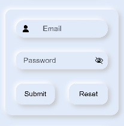

# Neumorphism_Form

# Installation :

Install using npm

```npm i hmos-neumorphism ```

# Note :

Add this css snippet when passing input or button through slot .

```css
button, input{
    width: 100%;
    height: 100%;
    background-color:transparent;
    text-color: black;
}
```

# Form



Import:
```html
<element name='neuform' src='../../../../../../node_modules/hmos-neumorphism/form/form.hml'></element>
```

Usage:
```html
<neuform width="350px" height="300px" border="20px" @submit-event="buttonClick" @reset-event="buttonClick">
 <neuinput icon="common/icons/user.png" type="email" maxlength="20" placeholder="Email" border="30px"></neuinput>
 <neuinput icon="" type="password" maxlength="20" placeholder="Password" border="20px"></neuinput>
 <div>
  <neubutton icon="" width="150px" border="20px">
   <input type='submit' style="border-radius:20px;">Submit</input>
  </neubutton>
  <neubutton icon="" width="150px" border="20px">
   <input type='reset' style="border-radius:20px;">Reset</input>
  </neubutton>
 </div>
</neuform>
```

# Input


Import:
```html
<element name='neuinput' src='../../../../../../node_modules/hmos-neumorphism/input/input.hml'></element>
```

Usage:
```html
<neuinput icon="common/icons/user.png" type="text" maxlength="20" placeholder="Input" width="300px" height="50px" border="50px" ></neuinput>
```

# Label


Import:
```html
<element name='neulabel' src='../../../../../../node_modules/hmos-neumorphism/label/label.hml'></element>
```

Usage:
```html
<neulabel text="Label" icon="common/icons/heart.png" width="200px" height="50px" border="50px" ></neulabel>
```

# Reference:

<a href="https://neumorphism.io/">neumorphism.io</a>

<a href="https://ismail9k.github.io/neomorphism/">ismail9k.github.io/neomorphism</a>
